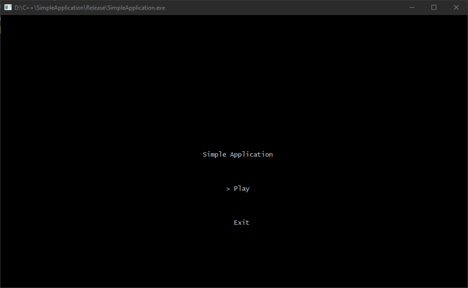

# Simple Application

## About

This is a simple showcase of what I can do with C++. I normally make projects using game engines, but projects like those require some art (which takes time to do), so I decided to do a simple console application.

The project is a playable turn-based battle system, where three characters can fight against a random number of enemies. There is no option to retry the battle because is not a game. 

Here is a gif with the project running:

## Controls

Arrow Keys and Enter / Return